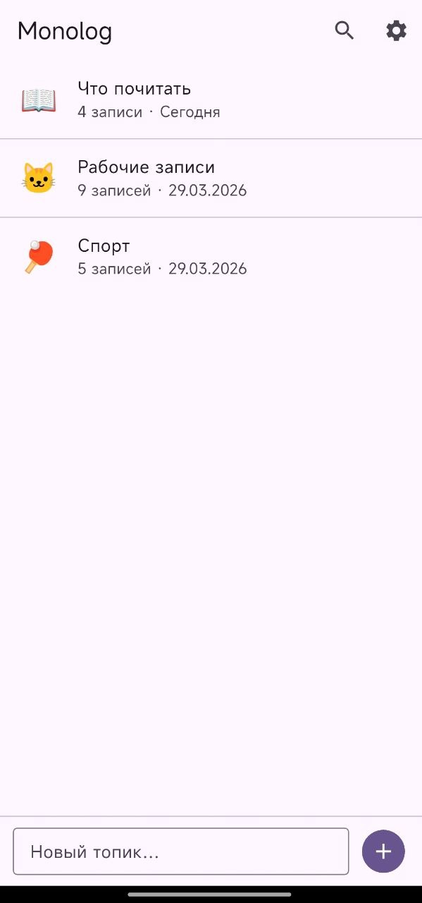
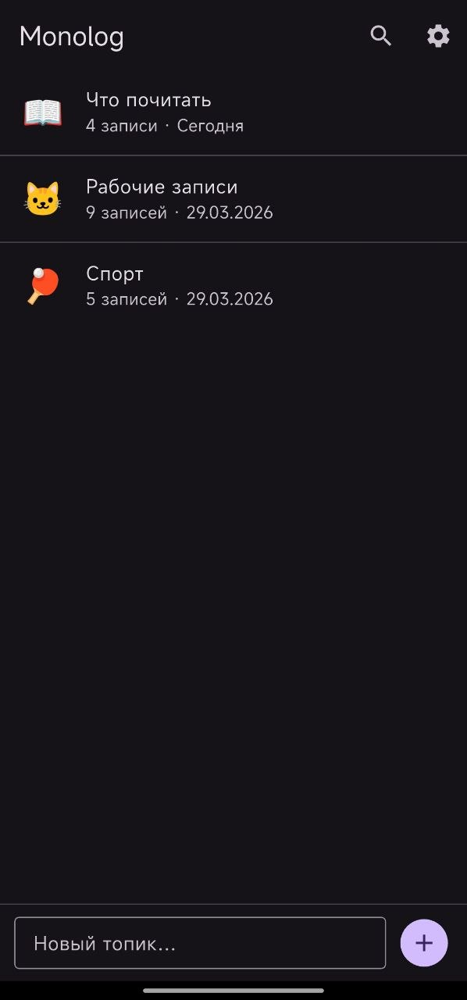

# Monolog

**Приватный блокнот для личных заметок** — локальное Android-приложение для хранения записей, организованных по топикам. Автономная замена Telegram-группы с топиками для личных заметок.

## Особенности

- 📱 **Полностью локальное** — все данные хранятся только на устройстве
- 🔒 **Приватность** — никаких аккаунтов, серверов и телеметрии
- ⚡ **Мгновенный отклик** — работает офлайн, SQLite под капотом
- 📁 **Топики** — организуйте заметки по категориям
- 📝 **Markdown** — форматирование текста (жирный, курсив, код, цитаты)
- 🖼 **Вложения** — изображения и файлы любых типов
- 🔗 **Link Preview** — карточки превью для ссылок (OpenGraph)
- 🔍 **Полнотекстовый поиск** — FTS5 с ранжированием BM25
- 📤 **Share Intent** — сохраняйте контент из других приложений в один тап
- 📦 **Импорт/Экспорт** — ZIP-архивы и импорт из Telegram

## Скриншоты

| Список топиков светаля тема | Список топиков темная тема  |
|:--------------:|:-------------:|
|  |  |

## Установка

### Google Play

*В процессе публикации*

### Сборка из исходников

**Требования:**
- Flutter 3.38.3 или новее
- Dart 3.10.1 или новее
- Android SDK (API 21+)

```bash
# Клонирование репозитория
git clone https://github.com/core-memory-labs/monolog.git
cd monolog

# Установка зависимостей
flutter pub get

# Запуск на устройстве
flutter run

# Сборка release APK
flutter build apk --release
```

## Технологии

| Компонент | Технология |
|-----------|------------|
| Фреймворк | Flutter 3.38.3 / Dart 3.10.1 |
| State management | Riverpod (AsyncNotifier) |
| База данных | SQLite (sqflite_common_ffi + sqlite3_flutter_libs) |
| Поиск | FTS5 с внешней таблицей контента |
| Минимальный API | Android 5.0 (API 21) |

### Основные зависимости

- `sqflite_common_ffi` + `sqlite3_flutter_libs` — SQLite с поддержкой FTS5
- `flutter_riverpod` — реактивное управление состоянием
- `receive_sharing_intent` — приём контента из других приложений
- `image_picker` / `file_picker` — выбор изображений и файлов
- `url_launcher` — открытие ссылок
- `share_plus` — системный share sheet
- `archive` — работа с ZIP-архивами
- `gal` — сохранение в галерею

## Архитектура

```
lib/
├── main.dart               # Точка входа
├── app.dart                # MonologApp, обработка share intent
├── models/                 # Доменные модели
│   ├── topic.dart
│   ├── entry.dart
│   └── entry_attachment.dart
├── services/               # Бизнес-логика
│   ├── database_service.dart   # CRUD, миграции, FTS5
│   ├── file_service.dart       # Хранение файлов
│   ├── export_service.dart     # ZIP-экспорт
│   └── telegram_import_service.dart
├── providers/              # Riverpod провайдеры
│   ├── topic_list_notifier.dart
│   └── entry_list_notifier.dart
├── screens/                # Экраны
│   ├── topic_list_screen.dart
│   ├── entry_list_screen.dart
│   ├── search_screen.dart
│   └── settings_screen.dart
├── widgets/                # Переиспользуемые виджеты
│   ├── entry_bubble.dart
│   ├── entry_input.dart
│   └── link_preview_card.dart
└── utils/                  # Утилиты
    ├── markdown_parser.dart
    └── date_format.dart
```

## Использование

### Топики

- **Создать** — введите название в поле внизу экрана
- **Редактировать / Удалить / Закрепить** — долгое нажатие на топик → contextual AppBar

### Записи

- **Создать** — введите текст в поле внизу, нажмите отправить
- **Прикрепить файл** — кнопка 📎 → Галерея / Камера / Файл
- **Редактировать / Копировать / Поделиться / Удалить** — долгое нажатие на запись
- **Мульти-выбор** — долгое нажатие активирует режим выделения

### Форматирование текста

```
*жирный* или **жирный**
_курсив_
~зачёркнутый~
`inline код`
```code block```
> цитата
```

### Импорт из Telegram

1. Экспортируйте чат из Telegram (JSON формат)
2. Откройте Настройки → Импорт из Telegram
3. Выберите файл `result.json`


### Тестирование

```bash
# Запуск всех тестов
flutter test

# Запуск с покрытием
flutter test --coverage
```

Тестовая инфраструктура:
- Mockito для моков сервисов
- sqflite_common_ffi для in-memory SQLite в тестах
- 67+ unit-тестов


## Известные ограничения

- Один файл на запись (множественные вложения в планах)
- Только Android (iOS возможен позднее)
- Markdown без вложенного форматирования

## Лицензия

*MIT License* — см. файл [LICENSE](https://github.com/core-memory-labs/monolog/blob/main/LICENSE)

## Автор

Core Memory Labs

---

<p align="center">
  <sub>Сделано с ❤️ для тех, кто ценит приватность</sub>
</p>
